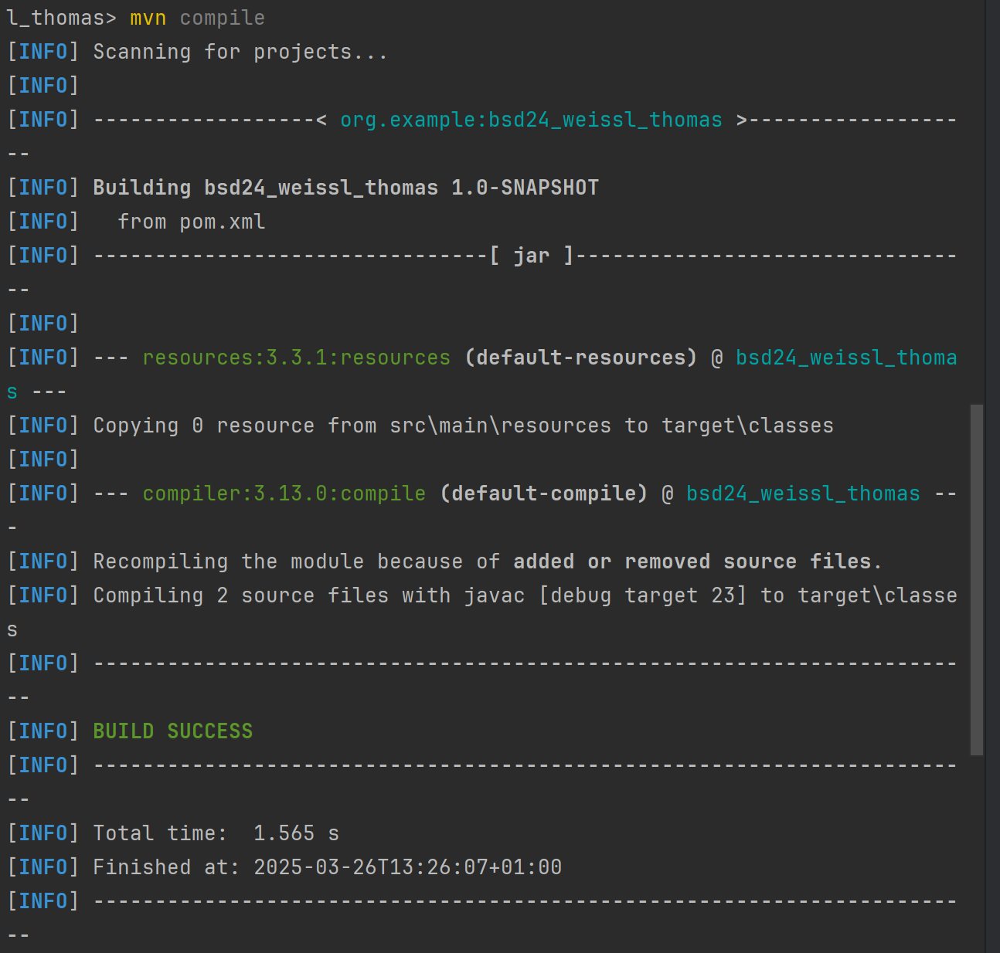

# Übung 3

## Nach der ersten Ausführung sollten Sie einen zusätzlichen Ordner in Ihrem Projekt sehen.

- Der Ordner target wurde erstellt nach der ersten Ausführung des Programms


## Erfolgreiches mvn compile

```bash
mvn compile
```



## mvn exec:java mit eigenem Namen


## Logger Info und Error

- Die Info Message wird nicht ausgegeben, aber die Error Message wird ausgegeben


## Logger in Datei speichern

