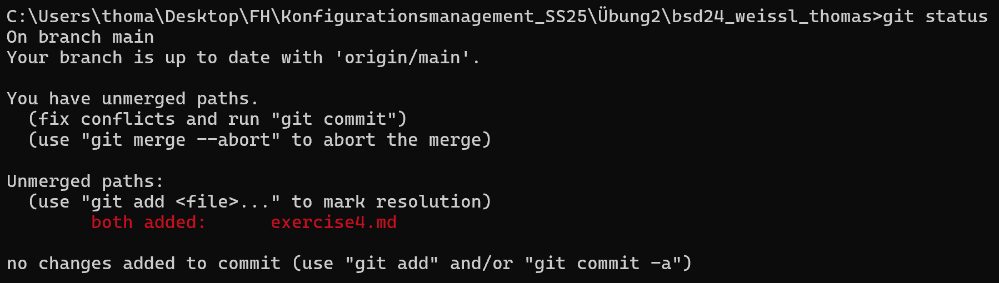
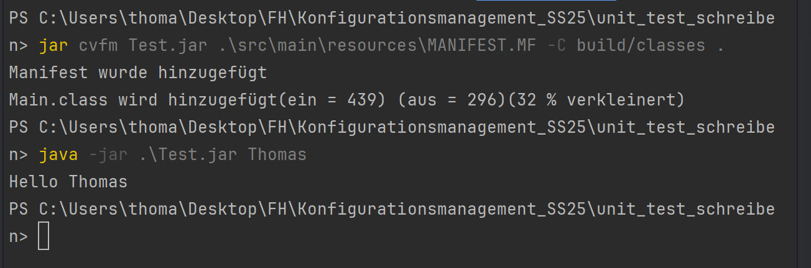
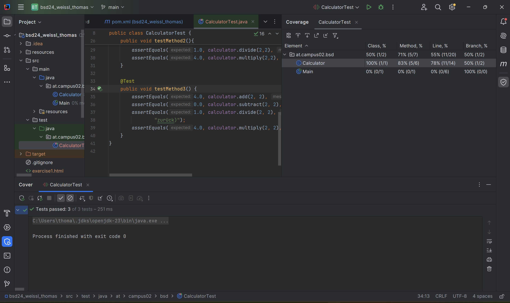
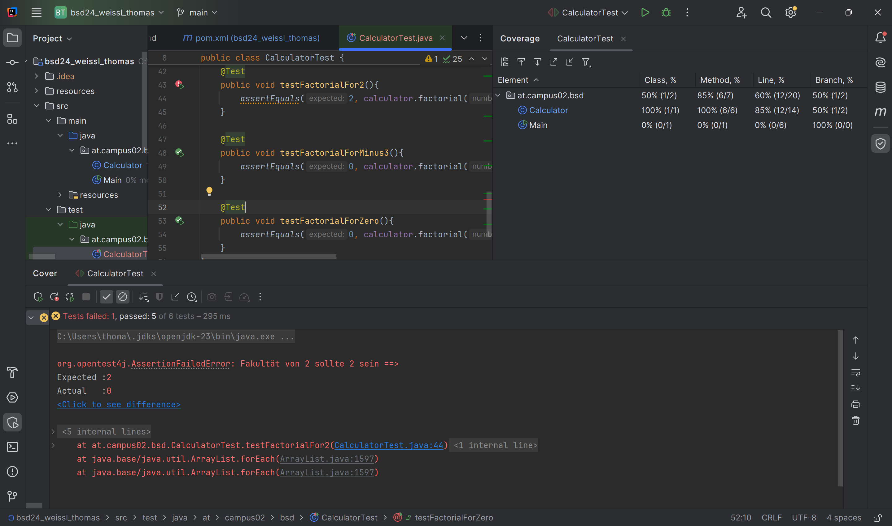

# Vorteile von Unit Tests

- schnelles testen der Programme
- um Bugs vorher zu erkennen
- ist (semi-)automatisch
- es ist sehr effektiv
- leichter fehler zu finden

 

## Jar Datei

### First test Method

Diese checkt die 4 Grundrechnungsarten für 1 und 2 aus.

### Second test Method

Diese checkt die 4 Grundrechnungsarten aus mit 2 und 2.

### Third test Method

Diese schaut die 4 Grundrechnungsarten mit 10 und 0 an, aber dividiert 0 darf nicht funktionieren. Es müsst also 0 zurückkommen

### Fakultät nicht implementiert

